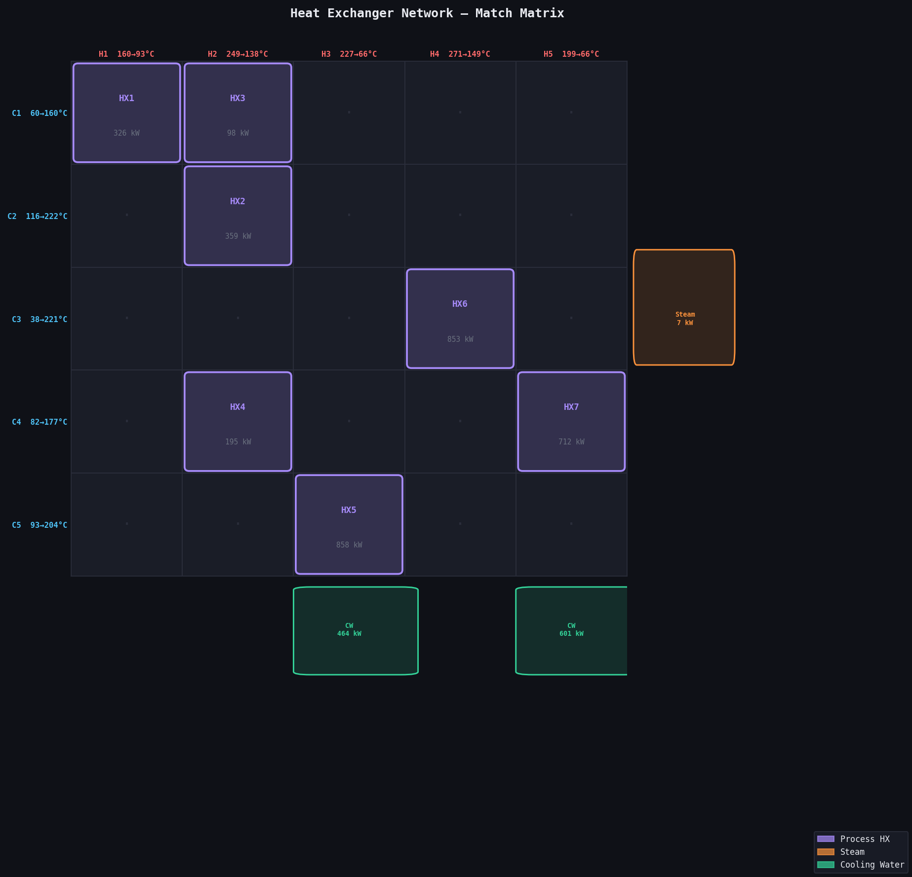
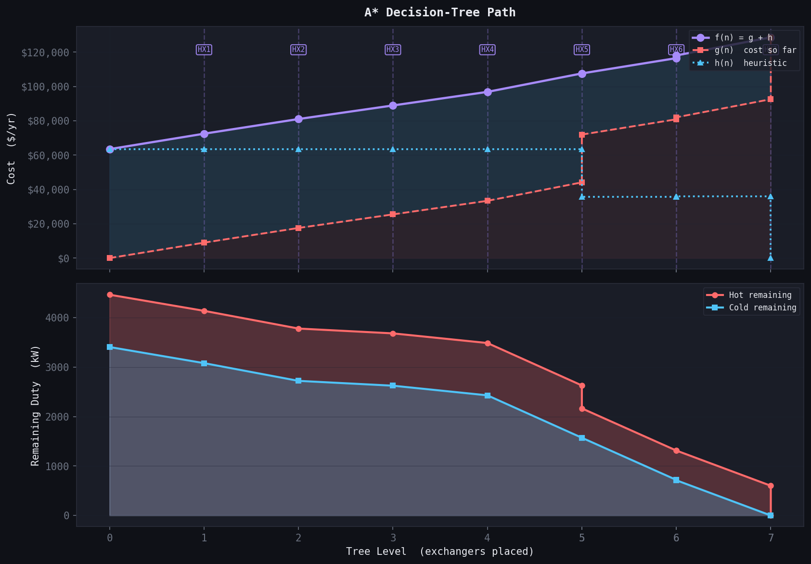
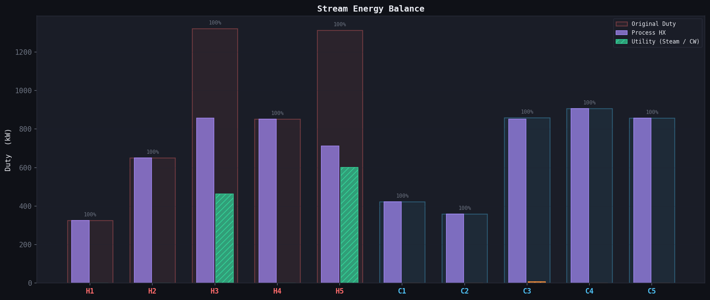
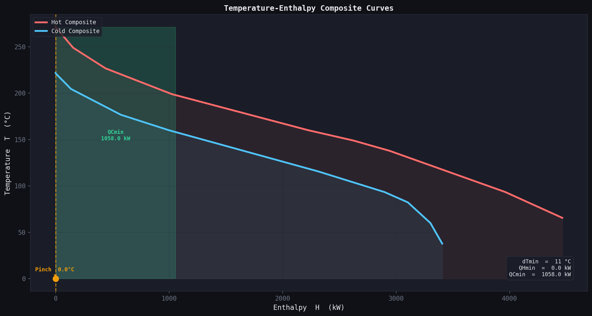

# Results — HENS-Astar

**Problem:** Pho and Lapidus (1973) 10SP1 benchmark, 5 hot streams and 5 cold streams  
**Algorithm:** A* Decision-Tree Search  
**Delta T min:** 11.1 °C (20 °F converted)

Stream data converted from BTU/hr.F and Fahrenheit. All values below are in SI units.

___

## Stream Data

| Stream | Type | T_in (°C) | T_out (°C) | FCp (kW/°C) | Duty (kW) |
|---|---|---|---|---|---|
| H1 | Hot | 160.0 | 93.3 | 4.885 | 325.7 |
| H2 | Hot | 248.9 | 137.8 | 5.861 | 651.3 |
| H3 | Hot | 226.7 | 65.6 | 8.206 | 1322.1 |
| H4 | Hot | 271.1 | 148.9 | 6.975 | 852.5 |
| H5 | Hot | 198.9 | 65.6 | 9.847 | 1313.0 |
| C1 | Cold | 60.0 | 160.0 | 4.235 | 423.5 |
| C2 | Cold | 115.6 | 221.7 | 3.379 | 358.6 |
| C3 | Cold | 37.8 | 221.1 | 4.689 | 859.7 |
| C4 | Cold | 82.2 | 176.7 | 9.601 | 906.8 |
| C5 | Cold | 93.3 | 204.4 | 7.722 | 858.0 |

Total hot duty: 4464.5 kW  
Total cold duty: 3406.5 kW  
Surplus: 1058.0 kW rejected via cooling water  
Feasible process pairs: 18 out of 25

___

## Optimal Network

### Match Matrix

Rows are cold streams, columns are hot streams. Numbers show the placement order.

```
            H1     H2     H3     H4     H5
  C1       [1]    [3]     .      .      .
  C2        .     [2]     .      .      .
  C3        .      .      .     [6]     .
  C4        .     [4]     .      .     [7]
  C5        .      .     [5]     .      .
```



### Process Heat Exchangers

| Unit | Hot | Cold | Duty (kW) | Annualized Cost ($/yr) |
|---|---|---|---|---|
| HX1 | H1 | C1 | 325.7 | 13,550 |
| HX2 | H2 | C2 | 358.6 | 9,267 |
| HX3 | H2 | C1 | 97.8 | 7,501 |
| HX4 | H2 | C4 | 194.9 | 7,891 |
| HX5 | H3 | C5 | 858.0 | 20,770 |
| HX6 | H4 | C3 | 852.5 | 8,932 |
| HX7 | H5 | C4 | 711.8 | 19,310 |

### Utility Units

C3 required a small steam top-up of 7.2 kW because no remaining hot stream could reach its target temperature after process exchange. H3 and H5 carry large duties relative to available cold targets and require cooling water for the remainder.

| Type | Stream | Duty (kW) | Annual Cost ($/yr) |
|---|---|---|---|
| Cooling Water | H3 | 464.0 | 27,842 |
| Cooling Water | H5 | 601.1 | 36,067 |
| Steam | C3 | 7.2 | 1,146 |

___

## Cost Summary

| Component | Cost ($/yr) |
|---|---|
| Exchanger Capital (annualized at 25%/yr) | 87,222 |
| Utility Operating Cost | 65,055 |
| **Total Annualized Cost (TAC)** | **128,646** |

___

## Search Performance

| Metric | Value |
|---|---|
| Nodes expanded | 745 |
| Nodes generated | 2,247 |
| Maximum tree depth reached | 7 |
| Solution depth | 7 |
| Time elapsed | 0.14 seconds |

### Tree Level Breakdown

| Level | Nodes Expanded |
|---|---|
| 0 | 1 |
| 1 | 3 |
| 2 | 15 |
| 3 | 62 |
| 4 | 219 |
| 5 | 323 |
| 6 | 74 |
| 7 | 48 |

Branching peaks at level 5 where stream loads are partially satisfied and the most combinations remain feasible. The collapse at levels 6 and 7 reflects streams approaching their targets with fewer viable partners remaining.



___

## Energy Balance

All streams satisfied within 0.5 kW tolerance.

| Stream | Status |
|---|---|
| H1 | Satisfied |
| H2 | Satisfied |
| H3 | Satisfied |
| H4 | Satisfied |
| H5 | Satisfied |
| C1 | Satisfied |
| C2 | Satisfied |
| C3 | Satisfied |
| C4 | Satisfied |
| C5 | Satisfied |



___

## Composite Curves and Pinch Analysis



The composite curve plot shows the hot and cold streams combined into single curves on a temperature-enthalpy diagram. The cold curve is shifted horizontally until the minimum vertical gap equals the delta T min of 11.1°C, which defines the pinch point. QHmin and QCmin are the minimum utility targets that thermodynamics requires regardless of network configuration — any feasible network must use at least these amounts.

___

## Notes

Pho and Lapidus (1973) could not solve this problem optimally by direct enumeration and resorted to a look-ahead heuristic with no optimality guarantee. This A* implementation finds the guaranteed optimal network in 745 node expansions and 0.14 seconds. H2 is the most active stream, matched against C1, C2, and C4. The small steam top-up on C3 (7.2 kW) is unavoidable once all hot streams have been exhausted against higher-priority cold targets.
